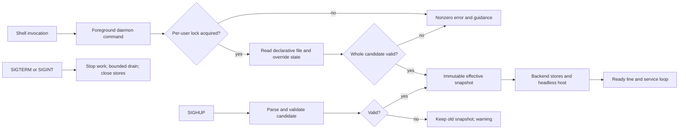

# Phase 6: Daemon Core and Configuration - Research

**Researched:** 2026-10-06  
**Domain:** Linux foreground Go service, XDG configuration, transactional settings  
**Confidence:** MEDIUM

<user_constraints>
## User Constraints (from CONTEXT.md)

### Locked Decisions
- **D-01:** A second foreground launch for the same user exits with a clear error and guidance to inspect or stop the existing instance. It does not replace or attach to the running daemon.
- **D-02:** Successful startup prints one concise ready message with the version and active configuration path; ongoing logs go to stderr.
- **D-03:** On a shutdown signal, stop accepting new work, allow a bounded grace period for work in progress, then close resources and exit. The exact grace duration is planner discretion.
- **D-04:** A startup failure identifies the file or setting, suggests a fix where possible, and exits nonzero. Invalid configuration never silently falls back to defaults when a file exists.
- **D-05:** Use one optional main declarative config file under the documented XDG config path. Omitted settings use documented defaults. A missing file is normal: start with defaults and do not create one.
- **D-06:** Support client changes for a small explicit set of existing general settings: relay settings, Blossom servers, and update preferences where applicable. Other settings remain file controlled. Research should verify which update preference actually exists before including it.
- **D-07:** Persist client changes atomically in a separate mutable state file under the XDG data path; never rewrite the main config file. — **Reversibility:** costly — changing this later would alter the persisted settings contract and require a state migration.
- **D-08:** Reload declarative configuration only on an explicit request: a signal in Phase 6 and a socket command once Phase 7 provides the control API. Do not watch the file automatically.
- **D-09:** A supported client change overrides the declarative file until that specific override is cleared. Clearing it reveals the file value, or the default when the file omits it. — **Reversibility:** costly — reversing precedence would change how existing persisted overrides affect configuration.
- **D-10:** Validate a reload as a whole. If invalid, reject the entire candidate, keep the last valid effective settings, and report the file and setting error. Do not partially apply fields.
- **D-11:** Basic health reports readiness, version, uptime, configuration status, storage status, and active window count. Phase 6 may report zero windows before launch control exists.
- **D-12:** Diagnostics default to a safe summary: current health, effective non-secret settings, and recent errors, with secrets and sensitive paths redacted. Exact schema and redaction details are planner discretion.
- **D-13:** A rejected reload leaves the service healthy with a visible warning identifying the rejected reload. The warning clears after a successful reload.
- **D-14:** Provide a local foreground status/diagnostics command in Phase 6 that reports what can be determined from daemon state and files. Live queries through the socket arrive in Phase 7. The command must not imply live information when it can only inspect files.

### the agent's Discretion
- Exact config format and filename, bounded shutdown interval, diagnostics output shape, and which existing update preferences qualify for mutable settings, provided the decisions above and roadmap requirements hold.

### Deferred Ideas (OUT OF SCOPE)
None — discussion stayed within phase scope.
</user_constraints>

<phase_requirements>
## Phase Requirements

| ID | Description | Research Support |
|----|-------------|------------------|
| SRVC-02 | A user can run the daemon in the foreground for development and diagnosis without systemd. | Independent Go command, instance lock, signal lifecycle, ready output. |
| SRVC-05 | A client can inspect daemon health, version, active windows, and actionable diagnostic information. | Typed health snapshot and honest offline status/diagnostics; socket exposure follows in Phase 7. |
| CONF-01 | A user can configure service behavior with documented files under XDG configuration paths and see effective non-secret settings through the socket. | Optional declarative file, typed effective snapshot, safe inspection; socket follows in Phase 7. |
| CONF-02 | A user can validate configuration and reload supported changes without losing the last known valid configuration. | Shared strict parser/validator, candidate transaction, SIGHUP reload. |
| CONF-03 | A client can change supported general service settings through the socket, with documented precedence relative to declarative files and atomic persistence. | Override model and durable write method in Phase 6; socket command follows in Phase 7. |
</phase_requirements>

## Summary

Use a Linux-only foreground command in the existing backend Go module, and expose a small service/configuration package that Phase 7 can call. This avoids importing Gio or the desktop `internal` packages. The backend already allows a nil `Host`, which selects `noopHost`, but `Start` also opens stores, loads `state.json`, starts asynchronous update/index/login work, and returns only a store-closure function. [VERIFIED: backend/backend.go:38-112] A daemon lifecycle therefore needs explicit ownership of those background tasks and the single-instance lock before claiming readiness. [VERIFIED: desktop/internal/instancelock/lock_unix.go:11-29] [ASSUMED]

Keep declarative settings, mutable overrides, and legacy application state separate. The current mutable candidates are discovery relays, Blossom servers, and the `DiscoverOnUserRelays` toggle. Their current persisted definitions are quoted below. [VERIFIED: backend/launcher_state.go:44-50] [VERIFIED: backend/launcher_state.go:90-95] There is no demonstrated persisted update preference: startup performs an unconditional delayed check and `CheckForUpdates` performs the round; a repository search found no update preference definition. Treat the negative conclusion as provisional and omit update preferences from the Phase 6 mutable schema. [VERIFIED: backend/backend.go:100-130] [VERIFIED: backend/registry_updates.go:18-43] [ASSUMED]

**Primary recommendation:** Plan an explicit configuration manager with `defaults → file → per-field override`, strict whole-candidate validation, atomic override persistence, and a backend settings adapter; launch it from a small foreground daemon with a truthful offline diagnostics mode. [ASSUMED]

## Architectural Responsibility Map

| Capability | Primary Tier | Secondary Tier | Rationale |
|------------|--------------|----------------|-----------|
| Foreground process, signals, instance lock | Linux daemon entry | backend | Process lifetime and per-user exclusion belong to the command; backend opens stores. [ASSUMED] |
| Config parsing, validation, precedence | Service configuration | backend | One effective snapshot should feed both service queries and backend discovery. [ASSUMED] |
| Mutable settings persistence | Service configuration | Filesystem | One data-file transaction for overrides. [ASSUMED] |
| Health and diagnostics | Service core | backend/storage | Only the running process knows readiness, uptime, errors, and live windows. [ASSUMED] |
| Socket control | Phase 7 API tier | Service core | Phase 7 adapts these methods to transport. [VERIFIED: .planning/ROADMAP.md:32-41] |

## Project Constraints (from AGENTS.md)

- Preserve two Go modules plus Android layout; put shared core in `backend/`, and keep OS-facing non-UI pieces in appropriate internal/platform files. [VERIFIED: AGENTS.md:3-9]
- Format Go with `gofmt`, use standard `testing`, and add focused regression tests for parsing, storage, networking, and lifecycle changes. [VERIFIED: AGENTS.md:20-27]
- Reproduce backend and desktop CI commands before PR; desktop compilation requires the child binary. [VERIFIED: AGENTS.md:11-18]
- Do not commit generated binaries, APKs, AARs, or `desktop/dist/`. [VERIFIED: AGENTS.md:29-31]
- This research task is explicitly limited to writing this file and not committing it. [VERIFIED: parent task]

## Standard Stack

| Component | Version | Use | Evidence |
|-----------|---------|-----|----------|
| Go standard library (`os`, `os/signal`, `encoding/json`, `context`, `syscall`) | Go 1.26.7 installed; backend module declares `go 1.26.2` | Files, strict decode, signals, cancellation, Unix advisory lock | [VERIFIED: local `go version` probe] [VERIFIED: backend/go.mod:1-3] [CITED: https://pkg.go.dev/os/signal#NotifyContext] |
| `backend/fileutil.WriteFileAtomic` | Existing repository helper | Durable override-state replacement | [VERIFIED: backend/fileutil/atomic.go:13-34] |
| `backend.Host` / `noopHost` | Existing repository interface | Headless backend startup in Phase 6 | [VERIFIED: backend/backend.go:70-73] [VERIFIED: backend/host.go:263-304] |

**Installation:** No new external package is recommended. [ASSUMED]

## Existing Values and File Map

These are existing source values, not a proposed new schema:

| Source | Verbatim value | Planning implication |
|--------|----------------|----------------------|
| `backend/launcher_state.go:44-50` | `Relays []string \`json:"relays"\``; `BlossomServers []string \`json:"blossom_servers"\`` | Current values live in broad `AppState`; new overrides need their own record. [VERIFIED: backend/launcher_state.go:44-50] |
| `backend/launcher_state.go:90-95` | `DiscoverOnUserRelays *bool \`json:"discover_on_user_relays,omitempty"\`` | Pointer already models unset/default versus explicit false. [VERIFIED: backend/launcher_state.go:90-95] |
| `backend/launcher_state.go:124-127` | `statePath = filepath.Join(dataDir, "state.json")` | Do not treat this file as the new override store. [VERIFIED: backend/launcher_state.go:124-127] |
| `backend/launcher_state.go:164-168` | `"relay.nostrapps.com"`, `"relay.nostrapps.com/public"` | Legacy default relay spellings lack an explicit `wss://` prefix; decide and document canonical output while preserving behavior. [VERIFIED: backend/launcher_state.go:164-168] |
| `backend/launcher_settings.go:18-21` | `"https://relay.nostrapps.com"`, `"https://nostr.download"` | Existing Blossom defaults. [VERIFIED: backend/launcher_settings.go:18-21] |
| `backend/launcher_settings.go:65-70` | `state.DiscoverOnUserRelays == nil || *state.DiscoverOnUserRelays` | Existing toggle defaults true. [VERIFIED: backend/launcher_settings.go:65-70] |

Recommended owners: new `backend/serviceconfig/` for pure paths/parser/validation/precedence and override persistence; new `backend/daemon/` for runtime, health, reload, and lock; new `backend/cmd/kwakore-daemon/` for command wiring; adapt `backend/launcher_state.go`, `backend/launcher_settings.go`, `backend/backend.go`, and discovery callers to consume one effective snapshot; keep Linux syscall pieces in `_linux.go`. Names and placements are proposed, not present source paths. [ASSUMED]

`desktop/internal/instancelock` cannot be imported from a backend-module command because Go `internal` visibility is limited to its parent tree; reimplement or relocate the small Unix lock under the service command's accessible tree. [CITED: https://go.dev/doc/modules/layout#internal-directories] [VERIFIED: desktop/internal/instancelock/lock_unix.go:11-29]

## Architecture Patterns

### System Architecture Diagram



### Configuration transaction

Recommend one optional JSON file at `$XDG_CONFIG_HOME/kwakore/config.json` (default `$HOME/.config/kwakore/config.json`) and a separate override JSON at `$XDG_DATA_HOME/kwakore/settings-overrides.json` (default `$HOME/.local/share/kwakore/settings-overrides.json`). These names are recommendations under D-05/D-07, not current paths. XDG defines both base directories, defaults, and absolute-path requirement. [ASSUMED] [CITED: https://specifications.freedesktop.org/basedir/latest/]

Use a typed struct with optional fields (`*bool`, pointer-to-slice or equivalent presence tracking). Distinguish absent, empty list, and explicit false; merge each field independently. Parse strict JSON with `Decoder.DisallowUnknownFields`, then a second `Decode` expecting `io.EOF`; validate URL schemes, hosts, duplicates, and any path/file-size limits before replacing the active snapshot. `DisallowUnknownFields` is a documented decoder behavior; the entire two-decode validation transaction is a design recommendation. [CITED: https://pkg.go.dev/encoding/json#Decoder.DisallowUnknownFields] [ASSUMED]

For client mutation: clone override state, change exactly one supported field, validate the merged candidate, serialize and call `fileutil.WriteFileAtomic(..., 0600)`, then publish the new snapshot only after the write succeeds. Clear deletes only that override key. The helper writes a same-directory temp file, syncs it, renames it, and syncs the parent directory on Unix; callers create the directory. [VERIFIED: backend/fileutil/atomic.go:13-34] [ASSUMED]

For reload: load file into a candidate, validate the full merged effective state, then publish once under a mutex or atomic pointer; on failure preserve the last valid file and effective snapshot and set a separate warning. Do not call the current setters one at a time during validation because they mutate state and silently drop invalid entries. [VERIFIED: backend/launcher_settings.go:33-63] [VERIFIED: backend/launcher_state.go:366-384] [ASSUMED]

### Lifecycle and diagnostics

Acquire the lock before opening backend stores, then parse config and overrides before backend startup. Use `signal.NotifyContext` for SIGINT/SIGTERM and a separate buffered `signal.Notify` channel for SIGHUP; `stop` restores default signal handling. [VERIFIED: desktop/internal/instancelock/lock_unix.go:11-29] [CITED: https://pkg.go.dev/os/signal#NotifyContext] [ASSUMED]

Expose `Health()` and `Diagnostics()` as in-process typed snapshots for Phase 7. Count active windows with `len(backend.OpenWindows())`; this existing method returns open instances, while `ManagedWindows()` also appends closed history and would overcount. [VERIFIED: backend/window_instances.go:190-225] Keep a bounded ring of error summaries rather than raw log text; diagnostic path fields should be replaced with a placeholder or basename, with no login material or full state file dump. [ASSUMED]

The Phase 6 offline `status`/`diagnostics` command should label `observed_from: files` (proposed field), report config path/validation and last persisted override parse status, and mark uptime/readiness/window count unavailable. The live `Health()` result exists only inside the daemon until Phase 7's socket. [ASSUMED]

## Don't Hand-Roll

| Problem | Use instead | Reason |
|---------|-------------|--------|
| Atomic override writes | `backend/fileutil.WriteFileAtomic` | Existing helper handles sync, same-directory rename, cleanup. [VERIFIED: backend/fileutil/atomic.go:13-34] |
| Signal cancellation | `os/signal.NotifyContext` | Standard cancellation semantics and handler cleanup. [CITED: https://pkg.go.dev/os/signal#NotifyContext] |
| Config parser | `encoding/json.Decoder` with typed structs | Existing Go standard library supports unknown-field rejection. [CITED: https://pkg.go.dev/encoding/json#Decoder.DisallowUnknownFields] |
| Existing per-user instance forwarding | Do not use desktop forwarding path | It forwards to the Gio launcher, contrary to D-01; retain only advisory-lock concept. [VERIFIED: desktop/main.go:120-151] |

## Runtime State Inventory

This phase introduces new XDG placement; v0.2 explicitly excludes old desktop-state migration. [VERIFIED: .planning/PROJECT.md:73-80]

| Category | Items Found | Action Required |
|----------|-------------|-----------------|
| Stored data | Existing `state.json`, `eventstore`, `kvstore` are created beneath `Options.DataDir`; `state.json` contains secrets, installed napps, rules, and current preferences. [VERIFIED: backend/backend.go:39-55] [VERIFIED: backend/nostr_system.go:12-29] [VERIFIED: backend/launcher_state.go:20-62] | New daemon uses new XDG data root; no old-state migration. Keep new override file distinct. [VERIFIED: .planning/PROJECT.md:73-80] [ASSUMED] |
| Live service config | None verified in the repository; desktop currently owns launcher startup. [VERIFIED: desktop/main.go:95-169] | No migration planned; verify deployed environment before packaging. [ASSUMED] |
| OS-registered state | Existing desktop shortcut/autostart integrations are part of old UI path; Phase 9 owns removal and native entries. [VERIFIED: backend/host.go:47-80] [VERIFIED: .planning/ROADMAP.md:55-66] | Do not alter registrations in Phase 6. [ASSUMED] |
| Secrets/env vars | Existing `AppState` can contain `ClientKey` and `Login` when no `SecretStore` is supplied. [VERIFIED: backend/launcher_state.go:20-36] [VERIFIED: backend/backend.go:50-54] | Do not surface file contents; Phase 8 owns signer secret mechanism. Explicitly assess daemon's interim `Secrets` choice. [ASSUMED] |
| Build artifacts | Existing desktop child binary is required for desktop test compilation. [VERIFIED: AGENTS.md:14-18] | New backend command must compile independently of desktop; no old binary rename yet. [ASSUMED] |

## Common Pitfalls

1. **Silent partial validation.** Existing setters normalize/drop malformed Blossom entries and accept relay strings after light prefixing; this conflicts with D-04/D-10. Parse and validate the entire candidate before any backend mutation, and test unknown keys, malformed URLs, second JSON document, empty list, and explicit false. [VERIFIED: backend/launcher_settings.go:33-63] [VERIFIED: backend/launcher_state.go:366-384] [ASSUMED]
2. **Two sources of truth.** `loadState()` defaults `Relays` when length is zero, so a user-selected empty relay list currently reverts after restart; `BlossomServers` distinguishes nil from empty. A new config layer must use explicit presence semantics and not reapply `state.json` preferences over it. [VERIFIED: backend/launcher_state.go:164-168] [VERIFIED: backend/launcher_settings.go:23-30] [ASSUMED]
3. **Claiming readiness too early.** `Start` launches indexing, update checks, and secret loading asynchronously; its return means stores initialized, not every background subsystem ready. Define readiness narrowly and avoid closing stores while those goroutines still use them. [VERIFIED: backend/backend.go:83-112] [ASSUMED]
4. **False live diagnostics.** A separate command cannot obtain daemon uptime/windows from files alone before Phase 7's socket. Label source and unavailable fields explicitly. [VERIFIED: .planning/ROADMAP.md:32-41] [ASSUMED]
5. **Leaking paths/secrets.** Existing state may contain login secrets, and errors may include paths. Redact before producing diagnostics or logs intended for clients; startup errors can identify config file as D-04 requires, but diagnostics should use a safe path representation. [VERIFIED: backend/launcher_state.go:20-36] [ASSUMED]
6. **Non-atomic apply after successful file write.** Persist and publish a clone only when both validation and write succeed; a failure must leave active and persisted overrides consistent. [ASSUMED]

## Code Examples

Proposed shape, not existing identifiers; all new names and paths in this sketch are design recommendations. [ASSUMED]

```go
// Source: Go standard-library JSON decoder docs; existing fileutil helper.
// https://pkg.go.dev/encoding/json#Decoder.DisallowUnknownFields
// backend/fileutil/atomic.go:13-34
func decodeStrict(r io.Reader, dst any) error {
    dec := json.NewDecoder(r)
    dec.DisallowUnknownFields()
    if err := dec.Decode(dst); err != nil { return err }
    var extra any
    if err := dec.Decode(&extra); err != io.EOF { return errors.New("trailing JSON value") }
    return nil
}
```

## Environment Availability

| Dependency | Required By | Available | Version | Fallback |
|------------|-------------|-----------|---------|----------|
| Go | Build and tests | Yes | 1.26.7 | — [VERIFIED: local `go version` probe] |
| Linux/Unix filesystem locking | Single instance | Yes: current shell is Linux and existing Unix lock implementation exists | — | — [VERIFIED: environment context] [VERIFIED: desktop/internal/instancelock/lock_unix.go:1-29] |
| systemd | Phase 9 | Not required by Phase 6 | — | Foreground mode [VERIFIED: .planning/ROADMAP.md:55-66] |

## Security Domain

Security enforcement is enabled in `.planning/config.json`. [VERIFIED: .planning/config.json:40-47]

| ASVS category | Applies | Phase 6 control |
|---------------|---------|-----------------|
| V2 Authentication | Later socket API | No remote auth in Phase 6; defer peer authentication to Phase 7. [VERIFIED: .planning/ROADMAP.md:32-41] |
| V3 Session Management | Later socket/API | No session interface in Phase 6. [VERIFIED: .planning/ROADMAP.md:32-41] |
| V4 Access Control | Yes, local files | Private data directory and owner-only override file; verify directory ownership/permissions before writes. [VERIFIED: backend/backend.go:115-125] [ASSUMED] |
| V5 Input Validation | Yes | Strict typed JSON and URL validation before swap. [CITED: https://pkg.go.dev/encoding/json#Decoder.DisallowUnknownFields] [ASSUMED] |
| V6 Cryptography | Existing secrets only | Do not introduce new crypto; keep secrets out of normal config/read snapshots. [VERIFIED: backend/launcher_state.go:20-36] [ASSUMED] |

| Threat | STRIDE | Mitigation |
|--------|--------|------------|
| Config with unexpected/secret-bearing key | Information disclosure / Tampering | Reject unknown fields, exclude signer secrets and raw state from diagnostics. [ASSUMED] |
| Other-user or symlinked state path | Tampering | Check ownership/mode and avoid following attacker-controlled paths before atomic writes; test permissions. [ASSUMED] |
| Reload races client mutation | Tampering | Serialize candidate merge, write, and pointer swap through one manager. [ASSUMED] |
| Diagnostics include login or bunker material | Information disclosure | Safe typed DTO allow-list rather than serializing `AppState`. [VERIFIED: backend/launcher_state.go:20-36] [ASSUMED] |

## Focused Verification for Planner

- Unit: XDG path defaults/absolute-env handling; missing config stays absent; malformed, unknown, duplicate/trailing JSON; defaults and explicit empty/false values. [CITED: https://specifications.freedesktop.org/basedir/latest/] [ASSUMED]
- Unit: file/override precedence, per-field clear, reload all-or-nothing, warning on failure and clearing on success, write failure leaves old active snapshot. [ASSUMED]
- Integration: foreground start emits one ready line, logs on stderr, second launch fails, SIGHUP valid/invalid reload, SIGTERM bounded shutdown, and no Gio manager window. [ASSUMED]
- Diagnostics: live window count uses `OpenWindows`; offline output never claims live uptime/window count; secrets and sensitive paths absent from safe report. [VERIFIED: backend/window_instances.go:190-207] [ASSUMED]
- Run `cd backend && go test ./...`; compile the new command and run focused tests. Run desktop regression command from AGENTS.md if backend settings adapters change. [VERIFIED: AGENTS.md:11-18]

## Assumptions Log

| # | Claim / recommendation | Risk if wrong |
|---|------------------------|---------------|
| A1 | No existing persisted update preference; omit from mutable schema. | A later client may expect a preference that exists outside searched source. |
| A2 | New daemon command belongs in backend module and uses JSON config. | Packaging or desired compatibility may call for a different entry path/format. |
| A3 | A single manager can adapt existing backend getters/setters without broad state redesign. | Backend globals may require wider lifecycle refactor. |
| A4 | An in-process health DTO plus honest offline command satisfies Phase 6 slice of SRVC-05/CONF-01/CONF-03 until Phase 7 transport. | Requirement interpretation may demand a live query earlier. |
| A5 | Existing process-owned lock can be reused conceptually without importing desktop internals. | Lock placement might change under future module rename. |

## Resolved Planning Questions

1. **Interim secret storage — resolved for Phase 6:** Use no interim keyring adapter and expose no signer or login control. The service-mode branch of backend.Start must not call loadSecrets, so passing no SecretStore cannot activate the current file-mode login path. It must not generate or write a new client key. The existing state loader may read an operator-supplied state.json, so diagnostics and config APIs must use allow-listed DTOs and never serialize AppState or raw secret fields. Phase 8 owns a protected signer mechanism. [VERIFIED: backend/backend.go:50-54,110] [VERIFIED: backend/launcher_secrets.go:442-481] [VERIFIED: .planning/ROADMAP.md:43-53] [PLANNED: 06-01, 06-04]
2. **Backend goroutine shutdown — resolved for Phase 6:** Give service mode a startup path that builds the profile index synchronously and populates the installed-list state synchronously. Do not call refreshInstalled unchanged: it launches broadcastIntentChanges and syncAppShortcuts in backgroundSyncs. Do not start the delayed update check or loadSecrets on this service path. Once ready, the service operation gate rejects new work on shutdown, waits at most five seconds for accepted operations, and only then closes stores and releases the lock. Future Phase 7/8 operation adapters must enter that gate and use cancellation for any new workers they introduce. The desktop Start path retains its behavior. [VERIFIED: backend/backend.go:83-112] [VERIFIED: backend/registry_install.go:37-45] [VERIFIED: backend/search.go:57-78] [PLANNED: 06-01]
3. **Canonical relay representation — resolved for Phase 6:** New service config, override persistence, effective reads and documentation use full wss:// URLs with nonempty hosts; paths are allowed. Normalize the two existing bare default strings to wss://relay.nostrapps.com and wss://relay.nostrapps.com/public. Reject bare hosts and other schemes in the new strict schema rather than silently prefixing or filtering them. Explicit empty lists remain empty. The old desktop setter retains its legacy behavior until the Phase 9 cleanup. [VERIFIED: backend/launcher_state.go:164-168,366-384] [PLANNED: 06-01, 06-02, 06-04]

## Sources

### Primary repository evidence
- `AGENTS.md`, `.planning/{CONTEXT,REQUIREMENTS,ROADMAP,PROJECT,config}.md/json` as cited above. [VERIFIED: source files read this session]
- `backend/backend.go`, `launcher_state.go`, `launcher_settings.go`, `launcher_secrets.go`, `registry_install.go`, `search.go`, `fileutil/atomic.go`, `host.go`, `nostr_system.go`, `window_instances.go`, `registry_updates.go`, `desktop/main.go`, `desktop/internal/instancelock/lock_unix.go`. [VERIFIED: source files read this session]

### Official documentation
- [XDG Base Directory Specification](https://specifications.freedesktop.org/basedir/latest/) — config/data defaults and path constraints. [CITED: https://specifications.freedesktop.org/basedir/latest/]
- [Go `os.UserConfigDir`](https://pkg.go.dev/os#UserConfigDir) — Unix config path behavior and relative-path error. [CITED: https://pkg.go.dev/os#UserConfigDir]
- [Go `os/signal.NotifyContext`](https://pkg.go.dev/os/signal#NotifyContext) — signal cancellation and stop semantics. [CITED: https://pkg.go.dev/os/signal#NotifyContext]
- [Go `encoding/json.Decoder.DisallowUnknownFields`](https://pkg.go.dev/encoding/json#Decoder.DisallowUnknownFields) — strict field rejection. [CITED: https://pkg.go.dev/encoding/json#Decoder.DisallowUnknownFields]
- [Go module layout](https://go.dev/doc/modules/layout#internal-directories) — internal import boundary. [CITED: https://go.dev/doc/modules/layout#internal-directories]

## Metadata

**Confidence breakdown:** stack MEDIUM (official Go docs and installed compiler); architecture MEDIUM (source-backed seams, proposed package boundaries); pitfalls HIGH for current source behavior and MEDIUM for future integration recommendations. [ASSUMED]  
**Research date:** 2026-10-06  
**Valid until:** 2026-11-05
