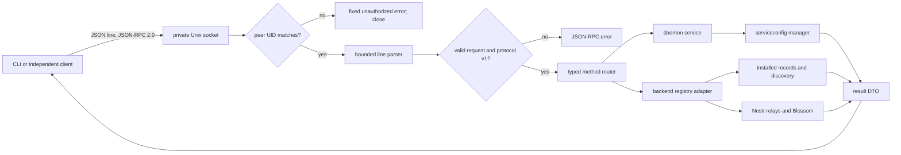

# Phase 7: Unix Socket and CLI - Research

**Researched:** 2026-10-06
**Domain:** Linux per-user Unix socket, JSON-RPC 2.0, Go CLI, existing napplet registry
**Confidence:** HIGH for in-repo integration; MEDIUM for documentation-backed protocol details

<user_constraints>
## User Constraints (from CONTEXT.md)

### Locked Decisions

### Protocol
- Use JSON-RPC 2.0 request and response objects. Require `jsonrpc: "2.0"`, correlate responses by `id`, and use its standard numeric error codes and concise messages plus documented application codes.
- Frame one complete JSON message per line on the Unix stream. Allow multiple calls on one connection.
- Use stable named methods such as `service.status` and `napplet.install`.
- Keep method parameters and results typed and documented for independent client authors. Respect JSON-RPC notification and batch semantics if supported; do not claim support without tests.

### Socket access
- Place the socket at `$XDG_RUNTIME_DIR/kwakore/daemon.sock` in a user-owned private directory.
- Enforce owner-only filesystem permissions and verify the connecting peer UID.
- Fail with an actionable setup error when `XDG_RUNTIME_DIR` is absent or invalid; do not fall back to a shared temporary directory.
- Remove a stale socket only after confirming no daemon is listening.

### CLI behavior
- Emit JSON by default for scriptable commands.
- Emit structured JSON errors on stderr and return nonzero exit status on failure.
- Use the standard runtime socket path, with an explicit `--socket` override.
- Wait for a final result on long operations with a documented timeout.

### Management operations
- Address napplets by full canonical Nostr address in requests.
- Return structured installed-version and outcome details for install and update.
- Uninstall requires an explicit CLI flag; direct RPC callers must state intent in params.
- Expose status, diagnostics, effective non-secret settings, reload, supported setting mutations, discovery, installed list, install, update, and uninstall within Phase 7's boundary.

### the agent's Discretion
Choose exact application error numbers, method parameters, timeout values, JSON result field names, and implementation package boundaries while preserving the decisions and roadmap success criteria above.

### Deferred Ideas (OUT OF SCOPE)
None — discussion stayed within phase scope.
</user_constraints>

<phase_requirements>
## Phase Requirements

| ID | Description | Research Support |
|----|-------------|------------------|
| SOCK-01 | Documented, versioned user-only Unix socket; reject other users. | Strict runtime-dir checks, Linux peer credentials, version handshake, listener lifecycle. |
| SOCK-02 | Stable machine-readable success/error, including malformed or unauthorized calls. | JSON-RPC parser, fixed error catalog, bounded line framing, peer rejection. |
| SOCK-03 | Every supported method reachable from scriptable CLI. | Shared protocol DTOs/client, JSON stdout and JSON error stderr, long-operation deadline. |
| SOCK-04 | Discover/search and list installed napplets. | Existing discovery and snapshot adapters, allow-listed registry DTO. |
| SOCK-05 | Install/update/uninstall through socket. | Canonical address resolution, synchronous outcome refactors, explicit uninstall intent. |
</phase_requirements>

## Project Constraints (from AGENTS.md)

- Keep shared core work in `backend/`; self-contained components may be subpackages. Linux-only files use the `_linux.go` pattern. [VERIFIED: AGENTS.md:3-10]
- Format Go with `gofmt`; use standard `testing`, `TestBehavior` names, colocated tests and focused regressions for parsing, networking, storage, and lifecycle. [VERIFIED: AGENTS.md:23-29]
- Run `cd backend && go test ./...` and the desktop child builds plus `cd desktop && go test -tags novulkan ./...` before a PR. Do not commit generated binaries. [VERIFIED: AGENTS.md:12-20] [VERIFIED: AGENTS.md:31-33]
- This phase should avoid edits to the desktop and Android UI; the project state requires shared backend Go changes to keep Android builds compiling. [VERIFIED: .planning/STATE.md:136]

## Summary

Use the existing Go toolchain and dependencies. Place a Linux-only socket server beside `backend/daemon`, add a small protocol package for request/response DTOs and a companion `backend/cmd/kwakore` client, and keep the backend registry as the sole owner of manifest selection, downloads, and installed state. No new third-party package is needed. [VERIFIED: backend/go.mod:1-15] [VERIFIED: backend/daemon/daemon_linux.go:1-20] [CITED: https://pkg.go.dev/net] [CITED: https://pkg.go.dev/encoding/json]

The key adaptation is to return final, structured outcomes from registry operations. `InstallNapp` already returns an error and completes synchronously, but `Update` and `Uninstall` report failures through UI state and return no result. `Discover` completes a relay fetch but replaces earlier runs, so a CLI refresh needs an inspectable completion result. Existing napplet IDs differ from full addresses for older napp records; RPC must translate canonical address to the installed record before invoking ID-based backend operations. [VERIFIED: backend/registry_install.go:73-87] [VERIFIED: backend/registry_updates.go:279-306] [VERIFIED: backend/registry_install.go:169-236] [VERIFIED: backend/registry_discovery.go:13-70] [VERIFIED: backend/napplet.go:78-86]

**Primary recommendation:** Implement a bounded, versioned JSON-RPC v1 adapter over a private Unix socket, then give discovery and mutations synchronous result-returning backend entry points shared with the existing UI wrappers.

## Architectural Responsibility Map

| Capability | Primary Tier | Secondary Tier | Rationale |
|------------|-------------|----------------|-----------|
| Runtime path and peer authorization | Local transport / daemon | OS kernel | Daemon owns listener; Linux supplies peer credentials. [CITED: https://pkg.go.dev/net] [VERIFIED: desktop/internal/instanceipc/peercred_linux.go:11-29] |
| JSON-RPC validation and routing | Local API / daemon | CLI client | Server enforces wire contract; client verifies response IDs. [CITED: https://www.jsonrpc.org/specification] |
| Settings and diagnostics | Daemon service | Configuration manager | Existing service methods serialize mutations and sanitize diagnostics. [VERIFIED: backend/daemon/daemon_linux.go:142-209] [VERIFIED: backend/daemon/health_linux.go:14-37] |
| Discovery and installation | Backend registry | Daemon adapter | Registry already owns event selection, downloads, state, and busy flags. [VERIFIED: backend/registry_select.go:54-94] [VERIFIED: backend/registry_install.go:83-166] |
| JSON output and exit status | CLI | Local API | CLI prints final result or structured error. [VERIFIED: .planning/phases/07-unix-socket-and-cli/07-CONTEXT.md:28-32] |

## Standard Stack

| Component | Version | Purpose | Evidence |
|-----------|---------|---------|----------|
| Go standard `net`, `os`, `bufio`, `encoding/json`, `context`, `flag` | Installed Go 1.26.7; module declares `go 1.26.2` | Unix listener/client, framing, parsing, deadlines, CLI flags | [VERIFIED: go version command, 2026-10-06] [VERIFIED: backend/go.mod:1-3] [CITED: https://pkg.go.dev/net] [CITED: https://pkg.go.dev/encoding/json] |
| `golang.org/x/sys/unix` | Existing `v0.48.0` indirect dependency | `SO_PEERCRED` peer UID retrieval | Dependency version is **verbatim** `"golang.org/x/sys v0.48.0 // indirect"`. [VERIFIED: backend/go.mod:64] [VERIFIED: desktop/internal/instanceipc/peercred_linux.go:5-29] [CITED: https://pkg.go.dev/golang.org/x/sys/unix] |
| Existing `backend/daemon`, `backend/serviceconfig`, root backend registry | In-repo Phase 6 | Service lifecycle and domain operations | [VERIFIED: backend/daemon/daemon_linux.go:24-39] [VERIFIED: backend/serviceconfig/config.go:19-55] |

**Installation:** None. The phase can use the existing module graph and standard library; no Package Legitimacy Audit is required. [VERIFIED: backend/go.mod:1-15]

## Architecture Patterns

### System Architecture Diagram



### Recommended Project Structure

```text
backend/daemon/                  # Linux listener, UID check, service method adapter
backend/controlprotocol/         # Portable JSON-RPC DTOs, errors, names, client framing
backend/cmd/kwakore/             # Linux CLI, JSON stdout/stderr, flags
backend/cmd/kwakore-daemon/      # Foreground listener wiring
backend/registry_*.go            # Shared synchronous registry result adapters
docs/                            # Wire and CLI reference
```

This is a proposed package layout. Keep `controlprotocol` free of backend side effects so it remains usable by independent clients and by backend packages without an import cycle.

### Pattern 1: Bind only after path and stale-listener checks

Validate `XDG_RUNTIME_DIR` as absolute, real, user-owned, exact `0700`; create or validate `kwakore` as user-owned `0700` without following a symlink; reject oversized `sun_path` with actionable guidance. Hold the existing daemon lock before inspecting the socket. If a socket inode exists, dial it with a short deadline: a successful connect means another listener is active and must not be removed; only a verified stale socket owned by the user may be unlinked. Bind with restrictive umask or validate/chmod socket to `0600`, then verify the inode remains the one just created. On peer UID mismatch, send one fixed JSON-RPC unauthorized error with `id: null` if writing is possible, then close without parsing any client bytes. Close the listener before backend stores and unlink only the owned inode. These are implementation recommendations grounded in XDG and existing lock/IPC patterns. [CITED: https://specifications.freedesktop.org/basedir/] [CITED: https://www.jsonrpc.org/specification] [VERIFIED: backend/daemon/daemon_linux.go:58-89] [VERIFIED: desktop/internal/instanceipc/ipc_unix.go:69-145]

The XDG specification suggests a fallback when the environment variable is missing, but the locked Phase 7 decision explicitly requires an error instead. [CITED: https://specifications.freedesktop.org/basedir/] [VERIFIED: .planning/phases/07-unix-socket-and-cli/07-CONTEXT.md:22-26]

### Pattern 2: Wire contract before command handlers

Publish an application protocol version through `service.status` (for example `protocol_version: 1`) and document a breaking-change rule. JSON-RPC's `jsonrpc: "2.0"` identifies the generic RPC specification, not the application's own method schema. Define one complete JSON value per newline, cap request and response line sizes, permit multiple sequential calls per connection, and set read/write deadlines. Implement and test JSON-RPC arrays as batches: respond with an array only when at least one member requires a response, return one object for an empty batch error, and permit response order to differ from request order. Execute valid notifications without sending any response, including when they are in a batch. Avoid method names beginning `rpc.`, which the specification reserves. [CITED: https://www.jsonrpc.org/specification] [CITED: https://pkg.go.dev/encoding/json]

Use `json.RawMessage` for the envelope and strictly decode each method's named parameter object. Reject duplicate envelope and parameter keys; the existing config decoder has a token-based duplicate-key check to adapt. Preserve the raw `id` for exact echo; distinguish absent `id` from explicit `null`; reject booleans, arrays, objects, and fractional numeric IDs as Invalid Request. Return exactly one of `result` or `error`, and a `null` ID when the request identity cannot be established. The spec mandates legal ID types and exact correlation; disallowing fractional IDs is a local simplification and must be documented. [CITED: https://www.jsonrpc.org/specification] [VERIFIED: backend/serviceconfig/config.go:155-180]

### Pattern 3: One documented method table

Recommended v1 methods and shapes (new design choices, not existing in-repo constants):

| Method | Named params | Result |
|--------|--------------|--------|
| `service.status` | `{}` | `{protocol_version, health}` |
| `service.diagnostics` | `{}` | existing sanitized diagnostics DTO |
| `settings.get` | `{}` | existing effective non-secret settings DTO |
| `settings.reload` | `{}` | `{settings}` or fixed config error |
| `settings.set` | `{field, value}` | `{settings}` |
| `settings.clear` | `{field}` | `{settings}` |
| `napplet.discover` | `{query, refresh}` | `{items, fetched_at, complete}` |
| `napplet.installed` | `{}` | `{items}` |
| `napplet.install` | `{address}` | `{address, outcome, installed_version}` |
| `napplet.update` | `{address}` | `{address, outcome, previous_version, installed_version}` |
| `napplet.uninstall` | `{address, confirm: true}` | `{address, outcome, previous_version}` |

The three supported setting names are **verbatim** `"relays"`, `"blossom_servers"`, and `"discover_on_user_relays"`; existing `Effective` JSON fields are **verbatim** `"relays"`, `"blossom_servers"`, and `"discover_on_user_relays"`. [VERIFIED: backend/serviceconfig/config.go:45-55] Existing service calls are **verbatim** `SetSetting(field string, value any)`, `ClearSetting(field string)`, and `Reload() error`. [VERIFIED: backend/daemon/daemon_linux.go:142-209] The method table's field names are recommended wire design, while these setting names come from source of truth.

Map JSON-RPC's standard errors exactly: `-32700` Parse error, `-32600` Invalid Request, `-32601` Method not found, `-32602` Invalid params, `-32603` Internal error; reserve an application-specific positive range for `unauthorized`, `not_found`, `busy`, `unavailable`, `no_update`, `config_invalid`, `closing`, and `timeout` and publish a table with fixed messages. These numeric standard codes and messages are **verbatim** from the specification. [CITED: https://www.jsonrpc.org/specification]

### Pattern 4: Canonical address and result adapters

Require the exact canonical coordinate, then parse with `ParseNappAddress` and reformat for equality. Its current parser also accepts naddr, nostr URI, embedded web link, and whitespace; the RPC contract should deliberately reject those convenient UI forms. `Napp.Address()` formats **verbatim** `"<kind>:<pubkey hex>:<d>"`; source comments identify **verbatim** `"35129:<pubkey>:<d>"`, `"15129:<pubkey>:"`, and the napp's `"35130"` form. [VERIFIED: backend/registry_address.go:20-54] [VERIFIED: backend/napplet.go:78-86]

For installed operations, find the record by `Address()` and pass its `ID` to existing backend functions; named napplet IDs are addresses but napp IDs are **verbatim** `"<pk16>~<d>"`. [VERIFIED: backend/napplet.go:78-86] Return a small allow-listed descriptor: canonical address, event ID, created-at timestamp, artifact hash where applicable, and availability. Existing `Napp` JSON also contains `Paths`, `Servers`, and nested `UpdateAvailable`; avoid exposing it wholesale or making UI state the socket schema. The existing field tags are **verbatim** `"paths"`, `"servers"`, `"eventId,omitempty"`, `"artifactHash,omitempty"`, and `"updateAvailable"`. [VERIFIED: backend/napp.go:71-113]

Use `InstallNapp` for blocking installs after `ResolveNappAddress`; refactor `Update` and `Uninstall` so new error/result-returning core functions keep their busy claims and storage/reclaim ordering, with old UI wrappers still setting FetchErr. Differentiate already absent from successfully removed, and no newer event from successful update. Do not infer completion by polling `Snapshot().Busy` or `FetchErr`. [VERIFIED: backend/registry_address.go:93-117] [VERIFIED: backend/registry_install.go:83-166] [VERIFIED: backend/registry_updates.go:279-306] [VERIFIED: backend/registry_install.go:169-236]

### Anti-Patterns to Avoid

- Exposing `backend.State` or full `Napp` across the wire: their fields include login/UI state or manifest detail unrelated to a management client. [VERIFIED: backend/launcher_ui.go:24-100] [VERIFIED: backend/napp.go:71-113]
- Calling `go backend.Install/Update/Uninstall` then returning success: the current UI APIs can fail later and only write a launcher error. [VERIFIED: backend/registry_install.go:73-81] [VERIFIED: backend/registry_updates.go:279-306] [VERIFIED: backend/registry_install.go:169-236]
- Holding a global socket/router lock during downloads: current install includes a 120-second download context and the service still needs to answer status. [VERIFIED: backend/registry_install.go:110-123]
- Passing raw `err.Error()` into RPC, diagnostics, or CLI stderr: validation errors can quote operator URLs and backend errors can include remote data. Existing Phase 6 deliberately sanitizes reload warnings. [VERIFIED: backend/serviceconfig/config.go:90-101] [VERIFIED: backend/daemon/daemon_linux.go:212-227]

## Don't Hand-Roll

| Problem | Don't Build | Use Instead | Why |
|---------|-------------|-------------|-----|
| JSON encoding | String concatenation or ad hoc escaping | `encoding/json` with typed DTOs and `RawMessage` | Correct JSON escaping and controlled schema. [CITED: https://pkg.go.dev/encoding/json] |
| Peer identity | Trust path permissions alone or a client-supplied UID | Kernel `SO_PEERCRED` via existing `x/sys/unix` pattern | Client text cannot authenticate itself. [VERIFIED: desktop/internal/instanceipc/peercred_linux.go:11-29] |
| Manifest winner and download validation | New relay selection or downloader in RPC | Existing backend `ResolveNappAddress` and `InstallNapp` | They preserve NIP-01 winner, invalid-latest refusal, busy flag, staging and swap. [VERIFIED: backend/registry_select.go:12-19] [VERIFIED: backend/registry_address.go:93-117] [VERIFIED: backend/registry_install.go:83-166] |
| Setting persistence | Direct JSON file edits from CLI | Existing service `SetSetting`, `ClearSetting`, `Reload` | Manager validates and serializes persistence. [VERIFIED: backend/daemon/daemon_linux.go:142-209] [VERIFIED: backend/serviceconfig/overrides.go:71-87] |

## Common Pitfalls

### 1. Stale socket deletion races with another listener
**What goes wrong:** A second daemon unlinks a live socket or follows a planted symlink. **Prevention:** Hold the existing data-dir lock, validate runtime path ownership/mode/type, probe existing socket with bounded dial, remove only a verified stale socket, and inspect the post-bind inode. **Warning sign:** A second daemon starts while the first still answers, or an unexpected non-socket exists at the path. [VERIFIED: backend/daemon/daemon_linux.go:58-89] [VERIFIED: desktop/internal/instanceipc/ipc_unix.go:125-145]

### 2. Shutdown closes stores while a socket mutation is still active
**What goes wrong:** `Service.Close()` waits only five seconds and then calls `closeBackend()`, but install and update downloads use a 120-second context. **Prevention:** Stop accepting, close or cancel idle connections, coordinate in-flight calls with service leases, and make backend mutations cancellable or wait safely for completion before closing stores. Preserve the existing reclaim lock order. **Warning sign:** SIGTERM during install yields a closed-store panic or corrupt/partial state. [VERIFIED: backend/daemon/daemon_linux.go:230-247] [VERIFIED: backend/registry_install.go:110-123] [VERIFIED: backend/registry_updates.go:337-350] [VERIFIED: backend/registry_install.go:187-224]

### 3. Response timeout does not imply operation cancellation
**What goes wrong:** A client times out while the daemon continues an install, then retries and receives busy or a changed installed version. **Prevention:** Thread cancellation through lookup and download paths, or explicitly document that timeout means outcome unknown and provide a deterministic status check; choose a CLI deadline longer than the bounded server operation. [ASSUMED] Candidate deadlines are 180 seconds for install/update and 30 seconds for reads, subject to implementation tests. **Warning sign:** CLI reports timeout while installed-list later changes. [VERIFIED: backend/registry_address.go:90-105] [VERIFIED: backend/registry_install.go:110-123]

### 4. Discovery and update outcomes are UI-shaped
**What goes wrong:** `Discover()` replaces prior runs; `Update()` and `Uninstall()` do not return errors; `Snapshot()` includes UI and login state. **Prevention:** Introduce result-returning core functions, keep old UI wrappers, and make search/list read immutable, allow-listed DTOs. **Warning sign:** RPC returns success before network work finishes or reports stale FetchErr. [VERIFIED: backend/registry_discovery.go:13-70] [VERIFIED: backend/registry_updates.go:279-306] [VERIFIED: backend/launcher_ui.go:24-100]

### 5. Wire parser accepts unbounded lines or ambiguous envelopes
**What goes wrong:** A local process can exhaust memory or smuggle a second JSON value into one frame; duplicate keys change what a parser sees; missing ID is mistaken for `null`. **Prevention:** bounded line reader, exactly one complete JSON value per line, strict envelope/member and parameter validation including duplicate keys, test multiple calls on one connection. [CITED: https://www.jsonrpc.org/specification] [CITED: https://pkg.go.dev/encoding/json] [VERIFIED: backend/serviceconfig/config.go:155-180]

### 6. Service discovery may have no catalog yet
**What goes wrong:** Headless service startup initializes installed state but does not run the desktop startup discovery/login flow. **Prevention:** offer an explicit refresh path with final completion and clear offline/empty distinction; search the refreshed or cached catalog. **Warning sign:** discover always returns an empty list after fresh daemon startup. [VERIFIED: backend/backend.go:103-126] [VERIFIED: backend/registry_discovery.go:28-70]

## Code Examples

### JSON-RPC line exchange

The following is a **proposed Phase 7 wire shape**, not an existing implementation:

```json
{"jsonrpc":"2.0","method":"service.status","params":{},"id":1}
{"jsonrpc":"2.0","result":{"protocol_version":1,"health":{"ready":true}},"id":1}
```

The `"jsonrpc":"2.0"` and matching `"id":1` follow the official request/response contract. The status method and `"protocol_version"` field are proposed discretion choices; the existing health field name is **verbatim** `"ready"`. [CITED: https://www.jsonrpc.org/specification] [VERIFIED: backend/daemon/health_linux.go:22-29]

### Peer credential check

Reuse the already-present Linux implementation shape: get `SyscallConn()`, run `unix.GetsockoptUcred(fd, unix.SOL_SOCKET, unix.SO_PEERCRED)` inside `RawConn.Control`, then compare the returned UID with `os.Geteuid()` before request decoding. This API sequence is already in the repository; extract or replicate it in a backend-owned Linux file rather than importing the desktop package. [VERIFIED: desktop/internal/instanceipc/peercred_linux.go:11-29] [CITED: https://pkg.go.dev/golang.org/x/sys/unix]

## Environment Availability

| Dependency | Required By | Available | Version | Fallback |
|------------|-------------|-----------|---------|----------|
| Go | Build/test | Yes | 1.26.7 | — [VERIFIED: go version command, 2026-10-06] |
| Linux Unix sockets and peer credentials | Runtime access | Yes, current host Linux/amd64 and existing implementation | Kernel version not probed | Test on target Linux user session. [VERIFIED: go version command, 2026-10-06] [VERIFIED: desktop/internal/instanceipc/peercred_linux.go:1-29] |
| `XDG_RUNTIME_DIR` | Normal daemon/CLI execution | Yes; `/run/user/1000` is owned by UID `1000` and mode `0700` in this research shell | — | Set a private test runtime directory in automated tests; fail with guidance when absent or invalid in production. [VERIFIED: stat command, 2026-10-06] [VERIFIED: .planning/phases/07-unix-socket-and-cli/07-CONTEXT.md:22-26] |

## Security Domain

Security enforcement is enabled by project config: `"security_enforcement": true`. [VERIFIED: .planning/config.json:47]

The ASVS categories below use the v4 category names requested by the research contract; ASVS v5 reorganizes these headings, so avoid treating the labels as current numbering. [CITED: https://wiki.owasp.org/images/d/d4/OWASP_Application_Security_Verification_Standard_4.0-en.pdf] [CITED: https://github.com/OWASP/ASVS]

| ASVS v4 category | Applies | Control for this phase |
|------------------|---------|------------------------|
| V2 Authentication | Yes | Validate kernel peer UID on every accepted connection before parsing commands. [VERIFIED: desktop/internal/instanceipc/peercred_linux.go:11-29] |
| V3 Session Management | Limited | No RPC login session is designed; each connection gets a fresh peer check. [CITED: https://www.jsonrpc.org/specification] |
| V4 Access Control | Yes | Server method allow-list; no Phase 8 launch, permission, or signer methods; require explicit uninstall intent. [VERIFIED: .planning/phases/07-unix-socket-and-cli/07-CONTEXT.md:6-9] [VERIFIED: .planning/phases/07-unix-socket-and-cli/07-CONTEXT.md:34-38] |
| V5 Input Validation | Yes | Strict JSON envelope, typed params, canonical address, bounded frame/array/string sizes. [CITED: https://www.jsonrpc.org/specification] [VERIFIED: backend/registry_address.go:20-54] |
| V6 Cryptography | Existing only | Reuse backend's manifest signature and ID verification; add no custom crypto. [VERIFIED: backend/registry_select.go:54-73] |

| Threat | STRIDE | Mitigation |
|--------|--------|------------|
| Foreign local user controls service | Spoofing / Elevation | `0700` runtime directory, `0600` socket, `SO_PEERCRED` UID check. [CITED: https://specifications.freedesktop.org/basedir/] [VERIFIED: desktop/internal/instanceipc/peercred_linux.go:11-29] |
| Local process monopolizes listener with oversized/idle frame | Denial of service | Line and connection limits, deadlines, bounded concurrent connections. [CITED: https://pkg.go.dev/net] |
| Raw error reveals local path, URL, or remote content | Information disclosure | Fixed app code/message; diagnostics remain sanitized; never put raw error in `error.data`. [VERIFIED: backend/daemon/daemon_linux.go:212-227] |
| Unexpected mutation via omitted uninstall intent | Tampering | Require `confirm: true` for direct uninstall, including notifications; do not emit a notification response. [CITED: https://www.jsonrpc.org/specification] [VERIFIED: .planning/phases/07-unix-socket-and-cli/07-CONTEXT.md:34-38] |

## Verification Strategy

`workflow.nyquist_validation` is explicitly false, so the formal Validation Architecture section is omitted. Focused tests are still required by repository guidance. [VERIFIED: .planning/config.json:17-27] [VERIFIED: AGENTS.md:27-29]

1. **Transport and parser:** private runtime path modes/ownership/symlink checks; active versus stale listener; peer UID mismatch; malformed JSON, invalid IDs/params, unknown method, extra JSON on a line, oversized line, multiple sequential requests, response correlation; single and mixed batch responses, empty batch, notification-only batch, and notifications that mutate but receive no response. Use real Unix socket tests with a replaceable peer-UID seam for the unauthorized path. [CITED: https://www.jsonrpc.org/specification] [VERIFIED: desktop/internal/instanceipc/ipc_unix_test.go:243-323]
2. **Service routing:** status and diagnostics only expose sanitized DTOs; set/clear/reload preserve Phase 6 precedence and last valid settings; shutdown closes listener before stores and drains or cancels active calls. [VERIFIED: backend/daemon/health_linux.go:14-37] [VERIFIED: backend/daemon/daemon_linux.go:142-209] [VERIFIED: backend/daemon/daemon_linux.go:230-247]
3. **Registry:** canonical-address rejection of short IDs/naddr, installed-list mapping, invalid-latest refusal, busy/no-update/not-installed outcomes, install/update version details, uninstall confirmation and state removal, rollback on failed download. Reuse existing backend registry fixture seams. [VERIFIED: backend/registry_address.go:20-54] [VERIFIED: backend/registry_install.go:83-166] [VERIFIED: backend/registry_updates.go:279-306]
4. **CLI end-to-end:** launch daemon in subprocess with private `XDG_RUNTIME_DIR`; run CLI as another process; assert JSON stdout, JSON stderr/nonzero exit for RPC, connection, and timeout errors; verify `--socket`; compare each CLI command with the corresponding raw JSON-RPC call. [VERIFIED: backend/cmd/kwakore-daemon/main_linux_test.go:22-110]
5. **Regression gate:** `cd backend && go test ./...`; desktop child builds and `cd desktop && go test -tags novulkan ./...` per AGENTS. Also cross-compile shared backend for Android because state guidance retains that constraint. [VERIFIED: AGENTS.md:12-20] [VERIFIED: .planning/STATE.md:136]

## Resolved Planning Questions

1. **RESOLVED — discovery final status (07-03):** Add a context-aware, result-bearing refresh entry point while retaining the progressive UI wrapper. The socket result carries items, fetched_at, and complete; a completed empty catalog has complete true and zero items. A cached read before any completed refresh has complete false and fetched_at null. An explicit refresh with no configured relays, an incomplete relay subscription, cancellation, timeout, or a superseding refresh returns a fixed unavailable, timeout, or conflict error rather than presenting an empty catalog as completed. Completion is based on the refresh operation's final relay/EOSE status, never a later read of UI FetchErr or Busy. [VERIFIED: backend/registry_discovery.go:28-70] [VERIFIED: backend/registry_discovery.go:92-140]
2. **RESOLVED — shutdown during a long download (07-04, 07-05):** Install and update gain context-aware result-returning cores, using the service work context as well as their bounded lookup/download contexts. The foreground command and daemon.Run close the listener before service teardown; Service.Close marks closing, cancels work, waits for every active RPC lease without the current five-second store-close cutoff, then closes backend stores and releases the lock. Registry leases span lookup, download, commit, and cleanup. A client-side timeout alone leaves the operation's outcome unknown; the CLI reports that explicitly and directs a state recheck. [VERIFIED: backend/registry_install.go:110-123] [VERIFIED: backend/registry_updates.go:337-350] [VERIFIED: backend/daemon/daemon_linux.go:230-247]
3. **RESOLVED — notification errors (07-01, 07-02, 07-06):** A valid notification has no ID and receives no response, even if its handler fails or it appears in a batch. The server still validates and executes it, including settings mutations; uninstall still requires confirm true. The CLI always sends requests with IDs because it promises a final machine-readable result/error. Documentation instructs third-party clients to use an ID-bearing request whenever they need an outcome. Malformed request objects retain the JSON-RPC Invalid Request response with id null; they are not treated as valid notifications. [CITED: https://www.jsonrpc.org/specification]

## Assumptions Log

| # | Claim | Section | Risk if Wrong |
|---|-------|---------|---------------|
| A1 | A 180-second write timeout and 30-second read timeout are adequate candidate values; choose after implementation tests. | Common Pitfalls | CLI may time out before final result. |

## Sources

### Primary
- [JSON-RPC 2.0 specification](https://www.jsonrpc.org/specification) — protocol, ID, notification, batch, reserved method prefix, error codes; updated 2013-01-04.
- [Go net package](https://pkg.go.dev/net) — Unix listener, connection, unlink behavior; checked 2026-10-06.
- [Go encoding/json package](https://pkg.go.dev/encoding/json) — decoder and RawMessage behavior; checked 2026-10-06.
- [Go x/sys/unix package](https://pkg.go.dev/golang.org/x/sys/unix) — peer credential API; checked 2026-10-06.
- [XDG Base Directory Specification](https://specifications.freedesktop.org/basedir/) — runtime directory use, mode, ownership, lifetime; checked 2026-10-06.
- [OWASP ASVS](https://github.com/OWASP/ASVS) and [ASVS 4.0 PDF](https://wiki.owasp.org/images/d/d4/OWASP_Application_Security_Verification_Standard_4.0-en.pdf) — category mapping; checked 2026-10-06.
- In-repo source citations inline throughout; files were opened with line-numbered reads this session.

## Metadata

**Confidence breakdown:** Standard stack HIGH (existing code and installed toolchain); architecture HIGH for in-repo seams, MEDIUM for proposed package/method design; pitfalls HIGH for code-observed lifecycle and error-result gaps.

**Research date:** 2026-10-06
**Valid until:** 2026-11-05 for stable protocol and Go APIs; recheck repository changes at planning time.
