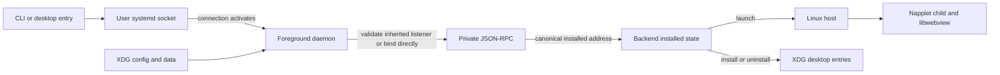

# Phase 9: Linux Packaging, Rename and Cleanup - Research

**Researched:** 2026-10-06  
**Domain:** systemd user socket activation, NixOS user units, Linux desktop entries, Go module cleanup  
**Confidence:** HIGH for repository integration; MEDIUM for NixOS deployment until evaluated on the target nixpkgs revision

<user_constraints>
## User Constraints (from CONTEXT.md)

### Locked Decisions

### Service installation and configuration
- **D-01:** Generic systemd installation enables the user socket; a client connection starts the daemon. — **Reversibility:** costly — changing the default later affects installed units and documented service behavior.
- **D-02:** Enabling the NixOS module also activates the user socket for configured users and provides the same service behavior as the generic installation.
- **D-03:** Provide an install helper for generic systems as well as complete manual unit installation instructions. The user clarified this after two conflicting selections.
- **D-04:** Keep ordinary configuration at the daemon's existing XDG config path; document effective paths and NixOS options.

### Native napplet desktop entries
- **D-05:** A desktop entry connects to the user socket and lets systemd activate the daemon if needed.
- **D-06:** When no graphical session is available, return a clear CLI-style error; do not add a dialog or notification solely for this case. Document where the error appears.
- **D-07:** Create one native desktop entry automatically per installed napplet and remove it automatically on uninstall. Preserve canonical address and launch-token safety rules from Phase 5.

### Rename and removal
- **D-08:** Switch supported Linux-facing identifiers and paths directly to `kwakore`, without Verdana compatibility aliases or migration. — **Reversibility:** one-way — deployed installations and third-party clients will use the new binary, socket, unit, and data paths as a published contract.
- **D-09:** Remove Android sources, gomobile bindings, and Android build wiring.
- **D-10:** Remove the Gio manager/store module and old UI paths, retaining the Linux child host required to run napplets.

### Documentation and verification
- **D-11:** Lead installation documentation with generic systemd setup, followed by the NixOS module.
- **D-12:** The Linux smoke test covers unit installation, socket activation, CLI control, and napplet launch.
- **D-13:** Keep a dedicated socket protocol reference and link to it from setup documentation.
- **D-14:** Include worked examples for signer setup, public status, errors, and diagnostics/logs.

### the agent's Discretion
Choose exact helper command syntax, packaging layout, NixOS option names, test fixtures, and documentation organization while preserving the choices above and the Phase 7 control protocol.

### Deferred Ideas (OUT OF SCOPE)
- Delete archived v0.1 planning records. The user requested this during rename discussion; it is separate from Phase 9's supported product-path cleanup and requires its own archival decision. Do not delete planning history as part of Phase 9.
</user_constraints>

<phase_requirements>
## Phase Requirements

| ID | Description | Research Support |
|----|-------------|------------------|
| SRVC-01 | A Linux user can start, stop, restart, and inspect the Kwakore daemon through their per-user systemd manager. | Inherited-listener contract, paired user units, live unit smoke. |
| LNXS-01 | A common systemd Linux user can install user service and socket units and run without Gio. | Generic package layout, helper/manual installation, child adjacency. |
| LNXS-02 | A NixOS user can install and configure declaratively with equivalent per-user behavior. | Replace old module/package, render user units, Nix config tree. |
| LNXS-03 | Installed napplets launch from native desktop entries through stable control. | Canonical address to token adapter, backend reconciliation, desktop-entry validation. |
| CLNP-01 | Remove Gio UI, Android and obsolete builds while preserving backend and Linux runtime. | Retention/deletion map and build order below. |
| CLNP-02 | Document installation, configuration, protocol, CLI, signer and graphical behavior. | Documentation map and smoke path below. |
| NAME-01 | Use `kwakore` in supported binaries, modules, units, XDG paths, entries, keyring identifiers, CI and docs. | Rename inventory and runtime-state audit below. |
</phase_requirements>

## Summary

The daemon and CLI already use a private runtime path, but the daemon currently calls `net.ListenUnix` itself and removes its socket on shutdown. A systemd `.socket` unit must instead own the same listener and pass its descriptor to the service; implement strict inherited-FD validation and retain direct binding for foreground runs. Its socket directory and inode permissions must match the existing owner-only checks. [VERIFIED: backend/daemon/socket_linux.go:40-75; backend/daemon/socket_linux.go:147-160] [CITED: https://github.com/systemd/systemd/blob/main/man/systemd.socket.xml] [CITED: https://www.freedesktop.org/software/systemd/man/252/systemd-socket-activate.html]

The existing Nix package builds the Gio `desktop` main binary and embeds children, whereas the daemon resolves a sibling `napplet` and adjacent `libwebview.so`. Rework Nix and release artifacts as a three-file runtime plus CLI, retaining the existing hardened child and WebKit patching checks. The existing NixOS module's launcher/autostart logic must be replaced with user service/socket units. [VERIFIED: nix/package.nix:29-65; nix/package.nix:75-153; backend/linuxhost/host_linux.go:34-46; backend/linuxhost/host_linux.go:264-290; nix/module.nix:8-52]

Native entries currently live behind the old Gio host. The Linux service host reports shortcut support as false, and service startup bypasses the normal shortcut pass. Move the safe Linux writer and reconciliation hook into retained code, derive an entry from each installed canonical napplet address, and route its token through the CLI to the existing `napplet.launch` RPC. Keep author data out of filenames and `.desktop` syntax. [VERIFIED: backend/linuxhost/host_linux.go:374-386; backend/backend.go:94-117; backend/app_shortcuts.go:44-74; backend/registry_service.go:15-23; desktop/internal/osintegration/appshortcut_linux.go:15-74; backend/cmd/kwakore/main_linux.go:389-396]

**Primary recommendation:** Plan socket adoption, retained Linux child packaging, service-owned desktop entry reconciliation, NixOS module replacement, then removal/rename and an installed-artifact smoke test in that dependency order. [VERIFIED: backend/daemon/socket_linux.go:48-90; backend/linuxhost/host_linux.go:34-46; backend/backend.go:94-117]

## Architectural Responsibility Map

| Capability | Primary Tier | Secondary Tier | Rationale |
|------------|--------------|----------------|-----------|
| Socket activation and lifecycle | Per-user systemd manager | Go daemon | Manager owns listener; daemon validates and serves inherited FD. [CITED: https://github.com/systemd/systemd/blob/main/man/systemd.socket.xml] |
| Control and validation | Go daemon | CLI | Preserve canonical RPC and client UID checks. [VERIFIED: backend/daemon/socket_linux.go:225-230; backend/daemon/rpc_linux.go:209-229] |
| Napplet entries | Daemon/backend integration | Desktop shell | Reconcile installed state into XDG applications; entry invokes CLI. [VERIFIED: backend/registry_install.go:34-46; desktop/internal/osintegration/appshortcut_linux.go:21-74] |
| Runtime window | Go Linux host and child | GTK/WebKit | Child stays separate and adjacent to daemon. [VERIFIED: backend/linuxhost/host_linux.go:34-46; backend/linuxhost/host_linux.go:54-83] |
| Nix settings | NixOS module | Go serviceconfig | Nix supplies non-secret XDG configuration; service validates it. [VERIFIED: backend/serviceconfig/config.go:25-42; backend/serviceconfig/config.go:269-299] |

## Project Constraints (from AGENTS.md)

- Keep the coupled backend core in its root package; keep self-contained service pieces in subpackages. [VERIFIED: AGENTS.md:3-8]
- Format Go with `gofmt`, use standard Go `testing`, and put focused regression tests beside parsing, permission, storage, networking, and lifecycle changes. [VERIFIED: AGENTS.md:26-34]
- Preserve plain JavaScript/CSS style without a new UI toolchain; put Linux-specific code in suffix files. [VERIFIED: AGENTS.md:26-29]
- Run backend tests and the applicable retained desktop/child tests before handoff; commit significant changes; do not commit binaries, APKs, AARs, or `desktop/dist/`. [VERIFIED: AGENTS.md:16-23; AGENTS.md:31-38]
- AGENTS.md still describes the old Verdana/Gio/Android structure and commands; update it with the new supported workflow as part of NAME-01/CLNP-02. [VERIFIED: AGENTS.md:3-23]

## Standard Stack

| Component | Version / source | Purpose | Recommendation |
|-----------|------------------|---------|----------------|
| Go | `go 1.26.2` declared by both current modules; local `go1.26.7`. [VERIFIED: backend/go.mod:1-3; desktop/go.mod:1-3] [VERIFIED: local `go version`] | Daemon, CLI, child. | Keep Go; move child-only module to a Linux-oriented path or maintain its existing module until imports are renamed in one atomic change. |
| systemd user manager | Local 259. [VERIFIED: local `systemctl --version`] | Per-user service/socket activation. | Use `.socket` with `ListenStream`, `SocketMode=0600`, `DirectoryMode=0700`, `Accept=no`; paired `.service` runs foreground daemon. [CITED: https://github.com/systemd/systemd/blob/main/man/systemd.socket.xml] |
| Nix/nixpkgs | Flake pins `nixos-26.05`; local Nix 2.34.7. [VERIFIED: flake.nix:4-5] [VERIFIED: local `nix --version`] | Declarative package and module. | Keep existing flake output structure under `kwakore`; use `systemd.user.sockets` and `.services`. [CITED: https://github.com/NixOS/nixpkgs/blob/master/nixos/modules/system/boot/systemd/user.nix] |
| Webview | Existing `github.com/abemedia/go-webview` pseudo-version in desktop module. [VERIFIED: desktop/go.mod:58-62] | Hardened child runtime. | Retain pinned version and generated `libwebview.so`; no new external package needed. [VERIFIED: desktop/internal/webviewlib/webviewlib.go:14-16] |
| Desktop entry specification | Version 1.5 listing on official spec index. [CITED: https://specifications.freedesktop.org/] | Launch from shell menus. | Use spec-compliant `Exec` escaping and `desktop-file-validate`. [CITED: https://specifications.freedesktop.org/desktop-entry/latest-single/] |

**External package installs:** None recommended. Reuse the pinned Go dependencies and Nix inputs already declared; the Package Legitimacy Gate is therefore not applicable. [VERIFIED: backend/go.mod:1-71; desktop/go.mod:1-97; flake.nix:1-7]

## Architecture Patterns

### System Architecture Diagram



The direct-foreground branch must keep its existing private runtime checks; the activated branch must verify `LISTEN_PID`, descriptor count/type/path and socket metadata before calling Go's `net.FileListener`, then avoid unlinking the manager-owned inode on close. `LISTEN_FDS`/`LISTEN_PID` and descriptor 3 are the standard activation contract. [VERIFIED: backend/daemon/socket_linux.go:40-90; backend/daemon/socket_linux.go:147-160] [CITED: https://www.freedesktop.org/software/systemd/man/252/systemd-socket-activate.html] [CITED: https://github.com/systemd/systemd/blob/main/man/systemd.socket.xml]

### Recommended Project Structure

```text
backend/cmd/kwakore-daemon/   daemon executable
backend/cmd/kwakore/          control CLI and safe desktop-token adapter
backend/daemon/               direct/inherited listener and RPC
backend/linuxhost/            Linux child launch and desktop integration
backend/desktopentry/         reusable Linux-only entry writer, if kept separate
desktop/child/                retained hardened window process
desktop/internal/webviewlib/  retained generated library source
nix/package.nix               daemon + CLI + child + library derivation
nix/module.nix                user socket/service options
packaging/systemd/user/       generic unit templates
scripts/install.sh            generic install helper
docs/                        service setup and protocol reference
```

These are proposed task locations, not existing paths, except those already present. [ASSUMED]

### Pattern 1: Socket unit and foreground service

Use one basename for both units, enable only the `.socket` under `sockets.target`, and leave service start/stop/restart available through `systemctl --user`. The socket unit should listen at `%t/kwakore/daemon.sock`; `%t` is the user runtime directory in user units. It must set `DirectoryMode=0700` because systemd otherwise defaults parent creation to 0755, and `SocketMode=0600` because the default is 0666. [CITED: https://github.com/systemd/systemd/blob/main/man/systemd.socket.xml] [CITED: https://github.com/systemd/systemd/blob/main/man/systemd.exec.xml]

Before the daemon accepts the inherited FD, compare it with the expected path; refuse extra/wrong descriptors and do not fall back to a fresh bind when activation metadata is malformed. This preserves the same trust boundary as direct startup. [VERIFIED: backend/daemon/socket_linux.go:40-75; backend/daemon/socket_linux.go:93-145] [ASSUMED]

### Pattern 2: One entry per installed napplet

Keep the backend's existing install/uninstall reconciliation trigger, but call it on service startup after registry recovery as well as on mutations. The current service startup returns before `refreshInstalled`, and its host's shortcut methods are no-ops. [VERIFIED: backend/backend.go:94-117; backend/registry_install.go:34-46; backend/linuxhost/host_linux.go:374-386]

Use the canonical address from installed records as the RPC target. Encode that address as an inert URL-safe token for `.desktop` `Exec`, decode only at the CLI boundary, and run the existing `napplet.launch` method with `{address:string}`. The current `backend.LaunchToken` encodes an internal ID, while the current CLI `launch` takes an address; reusing the ID token without this adapter would fail. Quote the exact existing forms: `LaunchToken(id string)` yields `"=" + base64.RawURLEncoding.EncodeToString([]byte(id))`, while CLI maps `launch ADDRESS` to `napplet.launch`. [VERIFIED: backend/shortcuts.go:58-67; backend/cmd/kwakore/main_linux.go:389-396; docs/control-protocol.md:35-35] [ASSUMED]

Do not reuse `com.verdana.napp.` entries in place: D-08 rejects compatibility/migration. Use a `kwakore` namespace, hash the canonical address for filenames, sanitize author title/description, and write atomically. The old writer contains the relevant safety patterns but is coupled to Gio's integration package and old launcher flags. Quote existing value: `const appShortcutPrefix = "com.verdana.napp."`. [VERIFIED: desktop/internal/osintegration/appshortcut.go:22-45; desktop/internal/osintegration/appshortcut_linux.go:21-74; desktop/internal/osintegration/appshortcut.go:62-70]

### Pattern 3: NixOS module settings

Use `systemd.user.sockets` plus `systemd.user.services`; Nixpkgs exposes both and renders them as user units. Scope socket and service to configured users with `ConditionUser`, which the official NixOS wiki documents for user services. [CITED: https://github.com/NixOS/nixpkgs/blob/master/nixos/modules/system/boot/systemd/user.nix] [CITED: https://wiki.nixos.org/wiki/Systemd/User_Services/en]

For optional declarative non-secret settings, generate a Nix store directory containing `kwakore/config.json` and set `XDG_CONFIG_HOME` for the user service to that directory. `ResolvePaths` already appends `"kwakore", "config.json"` to `XDG_CONFIG_HOME`, and config reads have no owner-only restriction; mutable overrides stay under the separate user data directory. This is a recommended design to test through `nix eval` and a live user service because it changes the effective XDG config root for that service. [VERIFIED: backend/serviceconfig/config.go:25-42; backend/serviceconfig/config.go:269-299] [ASSUMED]

### Anti-Patterns to Avoid

- A `.socket` file with the current daemon's unconditional bind will collide with the manager-owned socket. [VERIFIED: backend/daemon/socket_linux.go:48-75] [CITED: https://www.freedesktop.org/software/systemd/man/252/systemd-socket-activate.html]
- `RuntimeDirectory=` on the service alone can remove the directory while the socket unit remains active; let the socket unit own the directory lifetime. [CITED: https://github.com/systemd/systemd/blob/main/man/systemd.exec.xml] [ASSUMED]
- Do not put signer secrets into Nix store settings or unit `Environment=`; use the CLI's protected stdin/file path. [VERIFIED: backend/daemon/credentials_linux.go:49-88; backend/cmd/kwakore/main_linux.go:305-344]
- Do not use `Exec=kwakore launch <raw author address>`; desktop-entry field codes and line syntax give author data special meaning. [CITED: https://specifications.freedesktop.org/desktop-entry/latest-single/] [VERIFIED: backend/shortcuts.go:58-67]
- Do not retain old GUI search provider, autostart or generated manager desktop item in the package. [VERIFIED: nix/module.nix:20-52; nix/package.nix:168-196; scripts/install.sh:149-190]

## Don't Hand-Roll

| Problem | Do not build | Use instead | Why |
|---------|--------------|-------------|-----|
| Service lifecycle | Custom daemonizer or process monitor | systemd user service/socket | User manager already controls activation and lifecycle. [CITED: https://github.com/systemd/systemd/blob/main/man/systemd.socket.xml] |
| Desktop entry parser/launcher | Shell command interpolation | Existing safe token/atomic writer patterns plus desktop-entry specification | Raw author fields can break entry syntax. [VERIFIED: backend/shortcuts.go:58-67; desktop/internal/osintegration/appshortcut_linux.go:15-74] [CITED: https://specifications.freedesktop.org/desktop-entry/latest-single/] |
| Secret storage in declarative config | Nix string secret option | Existing protected signer command and private credential file | Config rejects secret fields and credential file is checked owner-only 0600. [VERIFIED: backend/serviceconfig/config.go:153-160; backend/daemon/credentials_linux.go:49-88] |

## Runtime State Inventory

| Category | Items Found | Action Required |
|----------|-------------|-----------------|
| Stored data | Old launcher data can contain IDs, state and keyring accounts; local `$HOME/.local/share/verdana` and `$HOME/.local/share/kwakore` are absent. New service data path is created with `filepath.Join(dataRoot, "kwakore")`. [VERIFIED: backend/serviceconfig/config.go:34-42] [VERIFIED: local existence probe] | No migration by D-08; rename code for new writes only. Avoid deleting unknown data. |
| Live service config | No matching active or installed `verdana*`/`kwakore*` user units were returned by local `systemctl --user` probes. [VERIFIED: local `systemctl --user list-unit-files/list-sockets`] | Package and enable new unit names; no local live service patch. Other machines are uninspected. |
| OS-registered state | Legacy installer writes autostart, GNOME provider, D-Bus service and desktop files; current local unit probe found none. [VERIFIED: scripts/install.sh:65-84; scripts/install.sh:149-190] [VERIFIED: local unit probe] | Remove old source/build wiring and document no-migration policy; do not use wildcard deletion of user files. |
| Secrets/env vars | Old Gio keyring service identifier is exactly `const service = "Verdana"`; service signer now uses a private `"signer-credentials.json"` file under data dir. Child startup still reads `"VERDANA_NAPP_ID"` and related `VERDANA_*` variables. [VERIFIED: desktop/internal/secretstore/secretstore.go:45-47; backend/daemon/credentials_linux.go:49-57; desktop/child/main.go:69-91] | Remove unused Gio keyring package; rename both host writer and child reader env names together, with a child smoke. No secret migration. |
| Build artifacts | Local `desktop/verdana` exists but is not a tracked source file; Nix build regenerates ignored webview libraries, and current release jobs produce `verdana-*` archives. [VERIFIED: local file probe; `git ls-files desktop/verdana`; desktop/internal/webviewlib/webviewlib.go:14-16; .github/workflows/desktop.yml:263-299] | Rebuild artifacts under new names; do not commit or manually migrate generated binaries. |

## Rename and Cleanup Boundary

| Keep and rename | Remove or replace | Evidence |
|-----------------|-------------------|----------|
| `backend/daemon/`, `backend/cmd/kwakore*/`, `backend/linuxhost/`, backend NAP/security code | No daemon or CLI replacement | [VERIFIED: backend/cmd/kwakore-daemon/main_linux.go:26-68; backend/linuxhost/host_linux.go:54-83] |
| `desktop/child/`, `desktop/internal/webviewlib/`, needed wire code, hardened `napplet` | Root Gio manager/store and unrelated desktop integration | [VERIFIED: desktop/child/main.go:22-29; backend/linuxhost/host_linux.go:34-46; desktop/go.mod:1-11] |
| Napplet host JS and security bindings, including `__verdana*` names until both ends/tests are changed atomically | Bundled manager/store/settings pages if not used by child | [VERIFIED: desktop/child/napplet.go:43-57; backend/webview/napplet-host.js:22-38] |
| Linux daemon/child packaging and tests | `android/`, `backend/mobile/`, gomobile targets and Android CI | [VERIFIED: justfile:23-34; .github/workflows/android.yml:1-139; backend/mobile/mobile.go:1-20] |
| Linux-only release build and backend/child CI | Windows/macOS old UI matrix and old `verdana-*` release artifacts | [VERIFIED: .github/workflows/desktop.yml:152-199; .github/workflows/desktop.yml:255-299] |

The old `scripts/install.sh` downloads one Verdana binary and installs old GUI integrations. Replace its behavior with a Linux service bundle installer; its checksum verification pattern remains useful. [VERIFIED: scripts/install.sh:117-147; scripts/install.sh:149-190]

## Common Pitfalls

1. **Activation collision:** Service startup sees an occupied socket and fails; test an actual first client connection after enabling the socket and confirm no daemon was running beforehand. [VERIFIED: backend/daemon/socket_linux.go:48-75] [CITED: https://www.freedesktop.org/software/systemd/man/252/systemd-socket-activate.html]
2. **Socket policy mismatch:** systemd's default socket/parent modes are broader than Phase 7's owner-only contract; assert inode 0600, parent 0700, same UID and expected path. [VERIFIED: backend/daemon/socket_linux.go:93-113] [CITED: https://github.com/systemd/systemd/blob/main/man/systemd.socket.xml]
3. **GUI environment missing:** A user manager may not have the session's `DISPLAY`/`WAYLAND_DISPLAY`; the host returns unavailable when both are empty. Document explicit `systemctl --user import-environment DISPLAY WAYLAND_DISPLAY XAUTHORITY` where needed and test a graphical launch through the manager. [VERIFIED: backend/linuxhost/host_linux.go:54-56] [CITED: https://github.com/systemd/systemd/blob/main/man/systemctl.xml]
4. **Nix store/child adjacency:** Replacing `/nix/store` executable with a wrapper can alter `os.Executable` resolution; verify that the daemon's resolved sibling is the built `napplet` and that `libwebview.so` is adjacent and patched. [VERIFIED: backend/linuxhost/host_linux.go:34-46; nix/package.nix:75-153] [ASSUMED]
5. **Shortcut drift:** Async mutation sync is not enough after a crash or daemon restart; reconcile on startup and after committed install/uninstall, including partial cleanup outcomes. [VERIFIED: backend/registry_install.go:34-46; backend/backend.go:94-117; backend/registry_service.go:50-84]
6. **Overzealous rename:** `Verdana` in CSS can mean the actual font family; third-party NAP test fixtures and old archived planning history are outside supported product identity. Review each match semantically before deleting or replacing it. [VERIFIED: backend/webview/napp-ui.css:26-29; backend/testdata/probe-napplet/metadata.json:1-3] [VERIFIED: .planning/phases/09-linux-packaging-rename-and-cleanup/09-CONTEXT.md:78-82]
7. **Headless entry visibility:** `Terminal=false` can hide stderr from a desktop shell; D-06 requires documented location of the CLI-style error. Choose `Terminal=true` for generated entries or a documented journal capture mechanism and verify where the JSON error appears. [VERIFIED: desktop/internal/osintegration/appshortcut_linux.go:63-74; backend/cmd/kwakore/main_linux.go:748-772] [ASSUMED]

## Code Examples

### Systemd user unit contract (proposed template)

```ini
# Source pattern: systemd.socket official reference; path/modes must be tested.
[Socket]
ListenStream=%t/kwakore/daemon.sock
SocketMode=0600
DirectoryMode=0700
Accept=no
[Install]
WantedBy=sockets.target
```

`ListenStream`, `SocketMode`, `DirectoryMode`, `Accept` and `WantedBy` are documented systemd keys. `kwakore/daemon.sock` is the existing daemon path: `const socketName = "daemon.sock"` and `filepath.Join(runtimeDir, "kwakore", socketName)`. [CITED: https://github.com/systemd/systemd/blob/main/man/systemd.socket.xml] [VERIFIED: backend/daemon/socket_linux.go:23-23; backend/daemon/socket_linux.go:40-46]

### CLI desktop adapter (proposed sequence)

```text
installed canonical address -> base64url token in Exec
kwakore launch-token TOKEN -> decode and validate canonical address
existing kwakore launch ADDRESS -> existing napplet.launch {address: ADDRESS}
```

This adapter is a recommendation, not an existing command. The current RPC expects exactly `"napplet.launch"` and `"address"`, and `ParseCanonicalServiceAddress` checks canonical spelling. [ASSUMED] [VERIFIED: backend/daemon/rpc_linux.go:209-225; backend/registry_service.go:15-23]

## State of the Art

The current repository has already moved foreground service, socket protocol, CLI and signer work into Phases 6–8, while Nix/release installer still target the old launcher. Plan Phase 9 as integration and retirement, not a new protocol. [VERIFIED: .planning/ROADMAP.md:23-116; flake.nix:18-35; nix/package.nix:39-65]

## Assumptions Log

| # | Claim | Section | Risk if Wrong |
|---|-------|---------|---------------|
| A1 | A Nix-generated `XDG_CONFIG_HOME` tree is acceptable as the declarative module's non-secret config source. | Architecture Patterns | User file override and effective path expectations may differ; verify in Nix module test. |
| A2 | A tokenized address CLI adapter can be added without changing protocol version 1. | Architecture Patterns | The token must be validated and bounded; test canonical and malicious addresses. |
| A3 | `Terminal=true` is an acceptable way to expose headless launch errors from desktop entries. | Common Pitfalls | Desktop behavior differs; live desktop test decides exact UX. |
| A4 | The Nix daemon binary can have a sibling child when wrappers are applied. | Common Pitfalls | Package layout may need a wrapper beside the child. |

## Open Questions

1. **Nix settings behavior:** Should the module expose one shared non-secret settings value for all configured users, or per-user settings? Recommend one shared settings option plus documented per-user XDG file when no module setting is supplied; verify the output with a NixOS evaluation test. [ASSUMED]
2. **Graphical environment:** Which desktop manager imports display variables into the user manager on supported distributions? Recommend documenting an explicit import command and testing graphical launch in the installed smoke. [CITED: https://github.com/systemd/systemd/blob/main/man/systemctl.xml] [ASSUMED]
3. **Entry error surface:** A desktop shell may consume an entry's stderr. Prefer a terminal-visible JSON error or a documented journal location, and use the live smoke to lock the choice. [ASSUMED]

## Environment Availability

| Dependency | Required By | Available | Version | Fallback |
|------------|-------------|-----------|---------|----------|
| Go | all Go builds | yes | 1.26.7 | — |
| systemd user manager | activation smoke | yes | 259; `is-system-running` returned `running` | — |
| Nix | package/module evaluation | yes | 2.34.7 | — |
| `just` | local build commands | yes | version not probed | direct commands |
| `desktop-file-validate` | entry validation | yes | version not probed | spec/manual check |
| Xvfb | graphical CI smoke | no local command | — | CI installs it; local graphical session if available |
| `patchelf` | Nix child fixup | no local command | — | Nix build input supplies it |
| `gomobile` | retired Android build | no | — | remove target |

These are direct local command/existence probes on 2026-10-06. [VERIFIED: local command probes]

## Security Domain

### Applicable ASVS Categories

| ASVS Category | Applies | Standard Control |
|---------------|---------|-----------------|
| V2 Authentication | yes, local peer identity | Keep SO_PEERCRED and client server-UID check. [VERIFIED: backend/daemon/socket_linux.go:225-230; backend/cmd/kwakore/main_linux.go:58-61] |
| V3 Session Management | yes, graphical/session scope | Keep headless refusal and opaque window IDs; test manager environment. [VERIFIED: backend/linuxhost/host_linux.go:54-56; backend/window_service.go:43-56] |
| V4 Access Control | yes | Owner-only runtime directory/socket and installed-only canonical launches. [VERIFIED: backend/daemon/socket_linux.go:93-113; backend/window_service.go:24-41] |
| V5 Input Validation | yes | Canonical address check; token and desktop-entry escaping. [VERIFIED: backend/registry_service.go:15-23; desktop/internal/osintegration/appshortcut_linux.go:50-74] |
| V6 Cryptography | yes, signer | Preserve existing private credential mechanism; no secret in Nix settings or logs. [VERIFIED: backend/daemon/credentials_linux.go:49-88; backend/serviceconfig/config.go:153-160] |

### Known Threat Patterns

| Pattern | STRIDE | Standard Mitigation |
|---------|--------|---------------------|
| Forged inherited FD or wrong socket path | Spoofing/Elevation | Verify PID, count, socket type, expected path, owner/mode before serving. [ASSUMED] [CITED: https://www.freedesktop.org/software/systemd/man/252/systemd-socket-activate.html] |
| World-readable socket parent from defaults | Information disclosure/Elevation | Set explicit 0700/0600 and assert at runtime. [CITED: https://github.com/systemd/systemd/blob/main/man/systemd.socket.xml] [VERIFIED: backend/daemon/socket_linux.go:93-113] |
| Crafted napplet address in `.desktop` key or `Exec` | Injection | Hash filename, sanitize display fields, use URL-safe token, canonicalize after decoding. [VERIFIED: backend/shortcuts.go:58-67; desktop/internal/osintegration/appshortcut.go:28-45] [CITED: https://specifications.freedesktop.org/desktop-entry/latest-single/] |
| Signer secret exposed in Nix store | Information disclosure | Restrict declarative settings to non-secret schema and use protected CLI input. [VERIFIED: backend/serviceconfig/config.go:153-160; backend/cmd/kwakore/main_linux.go:305-344] |

## Sources

### Primary

- Repository source files and line ranges cited inline; opened during this session.
- [systemd socket unit reference](https://github.com/systemd/systemd/blob/main/man/systemd.socket.xml) — listener, activation, socket and parent modes.
- [systemd socket activation test utility](https://www.freedesktop.org/software/systemd/man/252/systemd-socket-activate.html) — passed FDs and activation testing.
- [systemd exec reference](https://github.com/systemd/systemd/blob/main/man/systemd.exec.xml) — runtime directory and user environment.
- [systemctl reference](https://github.com/systemd/systemd/blob/main/man/systemctl.xml) — user manager environment import.
- [Nixpkgs user-unit implementation](https://github.com/NixOS/nixpkgs/blob/master/nixos/modules/system/boot/systemd/user.nix) — user service/socket module options.
- [Official NixOS user services guide](https://wiki.nixos.org/wiki/Systemd/User_Services/en) — scope and ConditionUser.
- [Desktop Entry Specification](https://specifications.freedesktop.org/desktop-entry/latest-single/) — Exec field and escaping.

### Research lookup notes

The research-plan seam selected Context7 for three library questions; no Context7 MCP or `ctx7` CLI was installed in this agent environment. Official upstream docs were consulted through web search instead. [VERIFIED: research-plan output and local `command -v ctx7`]

## Metadata

**Confidence breakdown:** Stack HIGH (existing toolchain and upstream specs); architecture HIGH for local interfaces, MEDIUM for proposed Nix config generation; pitfalls HIGH for observed integration seams, MEDIUM for desktop shell behavior.  
**Research date:** 2026-10-06  
**Valid until:** 2026-11-05 for repository observations; recheck nixpkgs/systemd docs on implementation day.
